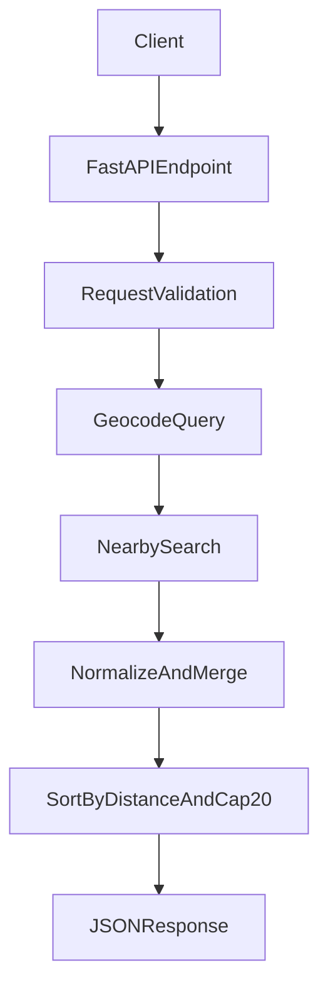

# Backend Plan: Nearby Places Search API

## Goal
Build a backend API that:
- Accepts free-text location input (e.g., "MG Road Bangalore", "Eiffel Tower", lat/lng string).
- Finds nearby cafes/restaurants around that point.
- Returns nearest results, capped at 20 (or fewer if unavailable).

## Recommended Option (Best Balance)
Use **Google Places API** for production quality, with this flow:
1. Geocode input location text -> latitude/longitude.
2. Run nearby search for `cafe` and `restaurant` around those coordinates.
3. Merge, de-duplicate, sort by distance, return top `limit` (max 20).

Why this option:
- Best POI coverage and data freshness.
- Consistent geocoding + nearby places stack.
- Easier ranking/metadata for user-facing apps.

## Multiple Choices (Provider Options)
1. **Google Maps Platform (Geocoding + Places Nearby Search)**
   - Best quality, easiest to ship fast.
   - Paid, requires API key and quota controls.
2. **Foursquare Places API**
   - Good quality, strong category support.
   - Paid tiers; slightly different category model.
3. **OpenStreetMap stack (Nominatim + Overpass)**
   - Lowest cost (often free/self-hosted).
   - More engineering effort, variable data completeness.

## API Contract
Create a new endpoint:
- `POST /api/places/nearby`

Request body:
- `query: str` (required, free-text location)
- `categories: list[str]` (optional, default `["cafe", "restaurant"]`)
- `radius_meters: int` (optional, default 3000, max 10000)
- `limit: int` (optional, default 20, max 20)

Response:
- `resolved_location: { name, lat, lng }`
- `places: [{ name, address, lat, lng, distance_meters, rating?, types?, provider_id }]`
- `count: int`

## Backend Changes (FastAPI)
Use and extend current files:
- Update router wiring in [`/Users/ramansharma/Desktop/TravelPlannerSWE/backend/main.py`](/Users/ramansharma/Desktop/TravelPlannerSWE/backend/main.py)
- Add endpoint in [`/Users/ramansharma/Desktop/TravelPlannerSWE/backend/routes.py`](/Users/ramansharma/Desktop/TravelPlannerSWE/backend/routes.py)
- Add request/response models in [`/Users/ramansharma/Desktop/TravelPlannerSWE/backend/models.py`](/Users/ramansharma/Desktop/TravelPlannerSWE/backend/models.py)

Add service layer files:
- [`/Users/ramansharma/Desktop/TravelPlannerSWE/backend/services/places_provider.py`](/Users/ramansharma/Desktop/TravelPlannerSWE/backend/services/places_provider.py) (provider interface)
- [`/Users/ramansharma/Desktop/TravelPlannerSWE/backend/services/google_places.py`](/Users/ramansharma/Desktop/TravelPlannerSWE/backend/services/google_places.py) (Google implementation)
- [`/Users/ramansharma/Desktop/TravelPlannerSWE/backend/services/place_utils.py`](/Users/ramansharma/Desktop/TravelPlannerSWE/backend/services/place_utils.py) (distance calc, dedupe, sorting, cap)
- [`/Users/ramansharma/Desktop/TravelPlannerSWE/backend/config.py`](/Users/ramansharma/Desktop/TravelPlannerSWE/backend/config.py) (env config and limits)

## Request Processing Logic
1. Validate input (`query` non-empty, `limit <= 20`, valid radius).
2. Resolve `query` to coordinates using provider geocoding.
3. Fetch nearby places for requested categories.
4. Normalize provider payload to internal schema.
5. Compute exact distance (Haversine), dedupe by provider id/name+address.
6. Sort ascending by distance.
7. Return `min(limit, 20, available_count)` places.
8. Return clear 4xx/5xx errors for invalid input, no matches, provider failures.

## Reliability and Performance
- Add short-lived cache (e.g., in-memory TTL 5-15 min) for repeated queries.
- Add per-IP rate limit to protect provider quota.
- Add timeout/retry with circuit-breaker-like fallback response.
- Log provider latency and error codes for monitoring.

## Security and Config
- Store API key in `.env` (never hardcode).
- Add config knobs: `DEFAULT_RADIUS`, `MAX_RADIUS`, `MAX_LIMIT=20`, request timeout.
- Restrict CORS origins from wildcard to known frontend origins before production.

## Testing Plan
- Unit tests for:
  - limit/radius validation
  - distance sorting
  - dedupe behavior
  - "fewer than requested" and "zero results" scenarios
- Integration tests with mocked provider responses:
  - successful geocode + nearby search
  - provider timeout/error mapping
  - mixed cafe+restaurant merged ordering

## Data Flow

## Rollout Steps
1. Implement models + endpoint contract.
2. Implement provider abstraction and Google provider.
3. Add utility logic (distance, dedupe, cap 20).
4. Add cache/rate-limit/config.
5. Add tests and sample curl/Postman collection.
6. Later: plug in second provider as fallback if needed.